# Genome Firewall

Genome Firewall is a research prototype for transparent genomic
antibiotic-resistance screening. It accepts a reconstructed bacterial FASTA,
runs sequence quality control and AMRFinderPlus, builds resistance features,
and returns calibrated per-antibiotic predictions with confidence, molecular
target compatibility, AMR evidence, and a conservative `no-call` option.

> **Research use only.** This project is not a clinical treatment system.
> Confirm every result with standard laboratory antimicrobial susceptibility
> testing (AST) and qualified human review.

## What the MVP includes

- A 100-genome *Escherichia coli* research cohort.
- 115 engineered AMR features and 947 AMRFinderPlus evidence rows.
- Models for ampicillin, ceftriaxone, and ciprofloxacin.
- Group-disjoint 60% training / 15% calibration / 25% test evaluation.
- Calibrated logistic models plus exploratory logistic regression, random
  forest, extra trees, and XGBoost comparisons.
- A FastAPI JSON backend and lightweight responsive HTML interface.
- A separate coverage window containing model metrics and their meanings.
- A Streamlit fallback interface.
- An optional GPT explanation layer that receives structured results only and
  cannot change model decisions.
- A configuration builder for drafting new bacteria, viruses, antibiotics,
  and target genes.

## Unique selling proposition

**Genome Firewall does not only predict antibiotic resistance—it knows when
not to predict, and makes that uncertainty visible.**

Most AMR tools emphasize either known resistance genes or a machine-learning
score. Genome Firewall combines both, then applies two explicit safety checks:
a calibrated confidence threshold and a molecular-target compatibility gate.
If the evidence is insufficient or the target cannot be verified, the system
returns `no-call` instead of presenting a confident-looking treatment answer.

The result is differentiated by five connected capabilities:

1. **Evidence plus prediction:** AMRFinderPlus evidence is shown beside the
   statistical model output rather than hidden behind one score.
2. **Safety-first abstention:** confidence and target gates can stop a model
   decision and explain exactly why.
3. **Inspectability:** users can review QC, probabilities, target status,
   evidence, held-out metrics, and no-call rates in the UI.
4. **Extensible routing:** one registry connects species, antibiotics, readers,
   molecular targets, and saved model artifacts.
5. **Constrained AI explanation:** GPT translates structured evidence into
   plain language but cannot see the FASTA or change the scientific result.

Short pitch:

> Genome Firewall is an evidence-grounded genomic AMR screening system that
> combines resistance markers with calibrated machine learning and a built-in
> safety firewall, returning a transparent no-call whenever the evidence is not
> strong enough.

## End-to-end pipeline

```mermaid
flowchart LR
    A[FASTA upload] --> B[FASTA quality control]
    B --> C[AMRFinderPlus]
    C --> D[115-feature matrix]
    D --> E[Species + antibiotic router]
    E --> F[Calibrated model]
    F --> G[Confidence no-call gate]
    G --> H[Molecular target gate]
    H --> I[Prediction + evidence + warning]
    I --> J[Optional GPT explanation]
```



The language model is downstream of the deterministic scientific pipeline. It
never receives the FASTA sequence, and it cannot alter probabilities,
predictions, target status, or the no-call decision.

## Current held-out results

These figures are exploratory and use genetically separated held-out groups.
The test sets—especially ceftriaxone—are too small for clinical claims.

| Antibiotic | Test genomes | Balanced accuracy | Resistant recall | Susceptible recall | AUROC | No-call rate |
|---|---:|---:|---:|---:|---:|---:|
| Ampicillin | 19 | 77.3% | 54.5% | 100.0% | 73.9% | 26.3% |
| Ceftriaxone | 7 | 50.0% | 0.0% | 100.0% | 83.3% | 57.1% |
| Ciprofloxacin | 20 | 87.5% | 75.0% | 100.0% | 95.3% | 20.0% |

Full reports are under [`reports/cohort100_test25`](reports/cohort100_test25).

## Quick start

### 1. Create the environment

The recommended environment includes AMRFinderPlus from Bioconda:

```bash
conda env create -f environment.yml
conda activate genome-firewall
```

If the environment already exists:

```bash
conda env update -f environment.yml --prune
conda activate genome-firewall
```

### 2. Configure the optional explanation layer

```bash
cp .env.example .env
```

Add your key to `.env` only if GPT explanations are required:

```dotenv
OPENAI_API_KEY=your-key-here
OPENAI_MODEL=gpt-4o-mini
OPENAI_LLM_ENABLED=true
```

`.env` is ignored by Git. Never commit API keys.

### 3. Start the HTML/FastAPI app

```bash
uvicorn api:app --host 127.0.0.1 --port 8001 --reload
```

Open:

- Main analysis UI: <http://127.0.0.1:8001/>
- Coverage dashboard: <http://127.0.0.1:8001/coverage/>
- API documentation: <http://127.0.0.1:8001/docs>

### 4. Optional Streamlit fallback

```bash
streamlit run app.py --server.address 127.0.0.1 --server.port 8502
```

Open <http://127.0.0.1:8502/>.

## Demo input

Use [`data/demo/mock_genome.fna`](data/demo/mock_genome.fna) for a safe UI
walkthrough. It is a small synthetic FASTA that passes QC and AMRFinderPlus
execution. It is not a real isolate and must not be used for biological or
clinical conclusions.

The spoken walkthrough is available at
[`docs/demo_walkthrough_script.md`](docs/demo_walkthrough_script.md).

## API

Useful endpoints:

| Method | Endpoint | Purpose |
|---|---|---|
| `GET` | `/api/health` | Service and optional LLM status |
| `GET` | `/api/config` | Available species, antibiotics, and LLM model |
| `GET` | `/api/overview` | Cohort, metrics, split, and model comparison |
| `POST` | `/api/predict` | FASTA QC, AMR evidence, predictions, and explanation |

Example:

```bash
curl -F species='Escherichia coli' \
     -F explain=false \
     -F file=@data/demo/mock_genome.fna \
     http://127.0.0.1:8001/api/predict
```

## Adding coverage

`targets_config.py` is the central registry for pathogens, antibiotics,
molecular targets, aliases, and active target pairs. The coverage page includes
a configuration builder that produces a downloadable draft snippet.

Adding a registry entry does not create a valid model by itself. A new target
must also have:

1. Sufficient labelled phenotype data for both classes.
2. A compatible feature reader and annotation database.
3. Reproducible feature generation.
4. Genetic-group separated training, calibration, and testing.
5. Saved and reviewed model artifacts.
6. Human validation before the target is enabled.

Bacteria currently use AMRFinderPlus. Virus entries remain disabled
placeholders until a validated virus-specific reader and database are
implemented.

Validate registry changes with:

```bash
python data_fetchers/validate_config.py
```

## Training and evaluation

The split proportions are configurable. The current MVP uses a 25% grouped
test set and a 15% grouped calibration set:

```bash
python data_fetchers/train_cohort.py \
  --labels data/raw/bvbrc/cohort100/selected_labels.csv \
  --metadata data/processed/cohort100_genome_metadata.csv \
  --groups data/processed/cohort100/genome_groups.csv \
  --features data/processed/cohort100/amrfinder_features.csv \
  --evidence data/processed/cohort100/amrfinder_evidence.csv \
  --target-presence data/processed/cohort100_target_presence.csv \
  --model-dir models/cohort100_test25 \
  --report-dir reports/cohort100_test25 \
  --test-size 0.25 \
  --calibration-size 0.15
```

Run the exploratory model comparison with:

```bash
python data_fetchers/benchmark_models.py \
  --labels data/raw/bvbrc/cohort100/selected_labels.csv \
  --metadata data/processed/cohort100_genome_metadata.csv \
  --groups data/processed/cohort100/genome_groups.csv \
  --features data/processed/cohort100/amrfinder_features.csv \
  --out reports/cohort100_test25/model_benchmark.csv \
  --model-dir models/cohort100_test25/benchmarks \
  --test-size 0.25 \
  --calibration-size 0.15
```

## Tests

```bash
pytest -q
node --check web/app.js
node --check web/coverage.js
python data_fetchers/validate_config.py
```

## Render deployment

The repository includes a Docker deployment because AMRFinderPlus is installed
through Conda/Bioconda.

1. Push the repository to GitHub.
2. In Render, choose **New → Blueprint**.
3. Select the repository and branch containing `render.yaml`.
4. Render builds the Docker image and checks `/api/health`.
5. Add `OPENAI_API_KEY` as a Render secret only if explanations are needed.

Render uses the following start command from the Dockerfile:

```bash
uvicorn api:app --host 0.0.0.0 --port ${PORT:-8000}
```

See [`docs/deployment_render.md`](docs/deployment_render.md) for details.

## Repository structure

```text
api.py                         FastAPI backend and HTML routes
app.py                         Streamlit fallback UI
targets_config.py              Species, virus, antibiotic, and target registry
web/                           HTML, CSS, and JavaScript UI
src/genome_reader/             FASTA QC, AMRFinderPlus, and feature extraction
src/predictor/                 Grouped splitting, training, routing, and inference
src/validation/                Metrics, reliability, and scorecards
src/explanation/               Optional evidence-grounded GPT explanation
data/demo/                     Synthetic demonstration FASTA
models/cohort100_test25/       Active saved model artifacts
reports/cohort100_test25/      Active metrics, predictions, and validation reports
docs/                          Deployment, API, video, and demo documentation
```

## Known limitations

- The dataset is small and limited to the current *E. coli* MVP.
- Ceftriaxone has only seven held-out genomes and requires substantially more
  validation data.
- AMRFinderPlus finding no reportable determinant does not prove
  susceptibility.
- Probability confidence and called accuracy must be interpreted together with
  no-call rate, calibration, target compatibility, and test-set size.
- The current target check is conservative; an uncertain target can override a
  model call even when the raw probability is high.
- External and prospective clinical validation have not been completed.

## Team deliverables

- [`docs/video_scripts.md`](docs/video_scripts.md) — technical and team videos.
- [`docs/team_video_presentation.pptx`](docs/team_video_presentation.pptx) —
  PowerPoint deck.
- [`docs/demo_walkthrough_script.md`](docs/demo_walkthrough_script.md) — live
  product walkthrough.

## License and data

Before public or commercial reuse, confirm the repository license and the
terms of each upstream genome and annotation source. Raw genome data and local
secrets are intentionally excluded from Git.
