# Genome Firewall


Genome Firewall is a research prototype for transparent genomic
antibiotic-resistance screening. It accepts a reconstructed bacterial FASTA,
runs sequence quality control and AMRFinderPlus, builds resistance features,
and returns calibrated per-antibiotic predictions with confidence, molecular
target compatibility, AMR evidence, and a conservative `no-call` option.

> **Research use only.** This project is not a clinical treatment system.
> Confirm every result with standard laboratory antimicrobial susceptibility
> testing (AST) and qualified human review.

> **Core proposition:** Evidence-grounded genomic prediction with a built-in
> safety firewall that abstains when confidence or biological compatibility is
> insufficient.

## Contents

- [Project overview](#project-overview)
- [Unique selling proposition](#unique-selling-proposition)
- [Architecture](#end-to-end-pipeline)
- [Modeling approach](#modeling-approach)
- [Held-out results](#current-held-out-results)
- [Quick start](#quick-start)
- [API](#api)
- [Safety and responsible AI](#safety-and-responsible-ai)
- [Adding coverage](#adding-coverage)
- [Training and evaluation](#training-and-evaluation)
- [Deployment](#render-deployment)
- [Limitations](#known-limitations)

## Project overview

| Area | Current MVP |
|---|---|
| Pathogen | *Escherichia coli* |
| Cohort | 100 genomes |
| Antibiotics | Ampicillin, ceftriaxone, ciprofloxacin |
| Feature space | 115 AMR determinant and evidence-summary features |
| Primary models | One calibrated logistic classifier per antibiotic |
| Benchmarks | Logistic regression, random forest, extra trees, XGBoost |
| Validation | Group-disjoint 60% train / 15% calibration / 25% test |
| Safety policy | 70% confidence threshold plus molecular-target gate |
| Interfaces | FastAPI, responsive HTML, JSON API, Streamlit fallback |

- A 100-genome *Escherichia coli* research cohort.
- 115 engineered AMR features and 947 AMRFinderPlus evidence rows.
- Models for ampicillin, ceftriaxone, and ciprofloxacin.
- Group-disjoint 60% training / 15% calibration / 25% test evaluation.
- Calibrated logistic models plus exploratory logistic regression, random
  forest, extra trees, and XGBoost comparisons.
- A FastAPI JSON backend and lightweight responsive HTML interface.
- A separate coverage window containing model metrics and their meanings.
- A Streamlit fallback interface.
- An optional GPT explanation layer that receives structured results only and
  cannot change model decisions.
- A configuration builder for drafting new bacteria, viruses, antibiotics,
  and target genes.

## Unique selling proposition

**Genome Firewall does not only predict antibiotic resistance—it knows when
not to predict, and makes that uncertainty visible.**

Most AMR tools emphasize either known resistance genes or a machine-learning
score. Genome Firewall combines both, then applies two explicit safety checks:
a calibrated confidence threshold and a molecular-target compatibility gate.
If the evidence is insufficient or the target cannot be verified, the system
returns `no-call` instead of presenting a confident-looking treatment answer.

The result is differentiated by five connected capabilities:

1. **Evidence plus prediction:** AMRFinderPlus evidence is shown beside the
   statistical model output rather than hidden behind one score.
2. **Safety-first abstention:** confidence and target gates can stop a model
   decision and explain exactly why.
3. **Inspectability:** users can review QC, probabilities, target status,
   evidence, held-out metrics, and no-call rates in the UI.
4. **Extensible routing:** one registry connects species, antibiotics, readers,
   molecular targets, and saved model artifacts.
5. **Constrained AI explanation:** GPT translates structured evidence into
   plain language but cannot see the FASTA or change the scientific result.

Short pitch:

> Genome Firewall is an evidence-grounded genomic AMR screening system that
> combines resistance markers with calibrated machine learning and a built-in
> safety firewall, returning a transparent no-call whenever the evidence is not
> strong enough.

## End-to-end pipeline

```mermaid
flowchart LR
    A[FASTA upload] --> B[FASTA quality control]
    B --> C[AMRFinderPlus]
    C --> D[115-feature matrix]
    D --> E[Species + antibiotic router]
    E --> F[Calibrated model]
    F --> G[Confidence no-call gate]
    G --> H[Molecular target gate]
    H --> I[Prediction + evidence + warning]
    I --> J[Optional GPT explanation]
```



The language model is downstream of the deterministic scientific pipeline. It
never receives the FASTA sequence, and it cannot alter probabilities,
predictions, target status, or the no-call decision.

## Modeling approach

Genome Firewall trains an independent binary classifier for every validated
species–antibiotic pair. This avoids treating resistance as one universal
label and makes each artifact, feature schema, split, and validation report
auditable at the antibiotic level.

### Feature engineering

AMRFinderPlus results are converted into a sparse, interpretable matrix. The
feature builder retains binary gene, mutation, sequence, and element indicators
and adds compact evidence summaries:

- Total AMR hit count.
- Number of distinct AMR classes and subclasses.
- Number of detected gene-level signals.
- Number of point-mutation signals.

Only AMR rows enter the model feature space; stress-response and virulence rows
emitted by AMRFinderPlus `--plus` remain in the source output but are excluded
from prediction features. The active cohort contains 115 numeric features.

### Primary calibrated models

The main inference path uses class-balanced logistic regression because it is
stable on a small, sparse dataset and keeps the relationship between features
and predictions relatively inspectable. Each base classifier is trained on the
training groups and then sigmoid-calibrated on a separate calibration split.
The test groups are untouched until final evaluation.

| Setting | Value |
|---|---|
| Objective | Binary susceptible (`0`) vs resistant (`1`) classification |
| Class handling | `class_weight="balanced"` |
| Optimizer limit | `max_iter=2000` |
| Calibration | Sigmoid calibration on the group-disjoint calibration set |
| Random seed | `42` by default |
| Saved unit | One model artifact per species–antibiotic pair |

### Comparative models

The benchmark suite evaluates four model families on the same group-disjoint
test assignment. These models are exploratory comparisons and are not silently
substituted for the calibrated primary model.

| Model | MVP configuration | Purpose |
|---|---|---|
| Logistic regression | Balanced classes, 2,000 iterations | Interpretable linear baseline |
| Random forest | 200 trees, balanced classes | Non-linear ensemble baseline |
| Extra trees | 200 trees, balanced classes | Randomized tree ensemble comparison |
| XGBoost | 100 trees, depth 2, learning rate 0.05 | Regularized boosting comparison |

### Leakage controls and evaluation

Near-identical genomes can make random row-level splitting look unrealistically
strong. Genome Firewall therefore assigns complete homology groups—not
individual rows—to training, calibration, or test. The active evaluation uses:

| Split | Requested proportion | Purpose |
|---|---:|---|
| Training | 60% | Fit model parameters |
| Calibration | 15% | Calibrate probabilities without touching test data |
| Test | 25% | Final held-out evaluation |

Actual row counts vary by antibiotic because phenotype availability and group
sizes differ. Every saved model includes a split receipt listing the rows and
genetic groups assigned to each partition.

### Decision and abstention policy

The model probability is only the first stage of the decision:

1. Probabilities at or above `0.5` indicate a raw resistant/“likely to fail”
   direction; lower values indicate a susceptible/“likely to work” direction.
2. Confidence is `max(p, 1-p)`. Values below `0.70` become `no-call`.
3. The molecular-target gate checks whether the relevant target machinery is
   verified. An absent or uncertain target can override a proposed call.
4. The API returns both the model call before the gate and the final decision,
   preserving the reason for every override.

This separation is central to the project: model confidence is not treated as
clinical certainty.

### Model artifacts and reproducibility

| Artifact | Contents |
|---|---|
| `*.joblib` | Fitted estimator, exact feature order, species, and antibiotic |
| `*.json` | Model receipt, class mapping, feature schema, and split summary |
| `*__splits.csv` | Genome-level train/calibration/test assignments |
| `model_metrics.csv` | Primary calibrated-model scorecard |
| `model_benchmark.csv` | Four-model exploratory comparison |
| `validation_report.json` | Metrics and safety-oriented validation output |
| `reliability.csv` | Probability calibration bins |

Active artifacts live under [`models/cohort100_test25`](models/cohort100_test25)
and [`reports/cohort100_test25`](reports/cohort100_test25).

## Current held-out results

These figures are exploratory and use genetically separated held-out groups.
The test sets—especially ceftriaxone—are too small for clinical claims.

| Antibiotic | Test | Balanced accuracy | Resistant recall | Susceptible recall | F1 | AUROC | Brier ↓ | No-call | Called accuracy |
|---|---:|---:|---:|---:|---:|---:|---:|---:|---:|
| Ampicillin | 19 | 77.3% | 54.5% | 100.0% | 70.6% | 73.9% | 0.219 | 26.3% | 78.6% |
| Ceftriaxone | 7 | 50.0% | 0.0% | 100.0% | 0.0% | 83.3% | 0.217 | 57.1% | 100.0% |
| Ciprofloxacin | 20 | 87.5% | 75.0% | 100.0% | 85.7% | 95.3% | 0.064 | 20.0% | 100.0% |

Full reports are under [`reports/cohort100_test25`](reports/cohort100_test25).

### How to read the metrics

| Metric | Interpretation | Preferred direction |
|---|---|---|
| Balanced accuracy | Average recall across resistant and susceptible classes | Higher |
| Resistant recall | Fraction of resistant genomes correctly identified | Higher |
| Susceptible recall | Fraction of susceptible genomes correctly identified | Higher |
| F1 | Balance between resistant precision and recall | Higher |
| AUROC | Ranking performance across classification thresholds | Higher |
| PR-AUC | Precision–recall performance, useful with imbalanced classes | Higher |
| Brier score | Error of predicted probabilities | Lower |
| No-call rate | Fraction withheld by confidence or safety policy | Context-dependent |
| Called accuracy | Accuracy among predictions that were not withheld | Higher |

## Quick start

### 1. Create the environment

The recommended environment includes AMRFinderPlus from Bioconda:

```bash
conda env create -f environment.yml
conda activate genome-firewall
```

If the environment already exists:

```bash
conda env update -f environment.yml --prune
conda activate genome-firewall
```

### 2. Configure the optional explanation layer

```bash
cp .env.example .env
```

Add your key to `.env` only if GPT explanations are required:

```dotenv
OPENAI_API_KEY=your-key-here
OPENAI_MODEL=gpt-4o-mini
OPENAI_LLM_ENABLED=true
```

`.env` is ignored by Git. Never commit API keys.

### 3. Start the HTML/FastAPI app

```bash
uvicorn api:app --host 127.0.0.1 --port 8001 --reload
```

Open:

- Main analysis UI: <http://127.0.0.1:8001/>
- Coverage dashboard: <http://127.0.0.1:8001/coverage/>
- API documentation: <http://127.0.0.1:8001/docs>

### 4. Optional Streamlit fallback

```bash
streamlit run app.py --server.address 127.0.0.1 --server.port 8502
```

Open <http://127.0.0.1:8502/>.

## Demo input

Use [`data/demo/mock_genome.fna`](data/demo/mock_genome.fna) for a safe UI
walkthrough. It is a small synthetic FASTA that passes QC and AMRFinderPlus
execution. It is not a real isolate and must not be used for biological or
clinical conclusions.

The spoken walkthrough is available at
[`docs/demo_walkthrough_script.md`](docs/demo_walkthrough_script.md).

## Technology stack

| Layer | Technologies |
|---|---|
| Bioinformatics | NCBI AMRFinderPlus, Biopython |
| Data processing | pandas, NumPy |
| Machine learning | scikit-learn, XGBoost, joblib |
| API | FastAPI, Uvicorn, multipart uploads |
| Frontend | Responsive HTML, CSS, JavaScript |
| Alternative UI | Streamlit |
| Explanation | OpenAI Responses API with a constrained structured payload |
| Deployment | Docker, Conda/Bioconda, Render Blueprint |

## API

Useful endpoints:

| Method | Endpoint | Purpose |
|---|---|---|
| `GET` | `/api/health` | Service and optional LLM status |
| `GET` | `/api/config` | Available species, antibiotics, and LLM model |
| `GET` | `/api/overview` | Cohort, metrics, split, and model comparison |
| `POST` | `/api/predict` | FASTA QC, AMR evidence, predictions, and explanation |

Example:

```bash
curl -F species='Escherichia coli' \
     -F explain=false \
     -F file=@data/demo/mock_genome.fna \
     http://127.0.0.1:8001/api/predict
```

## Safety and responsible AI

- Raw FASTA sequences remain inside the deterministic bioinformatics pipeline
  and are never included in the GPT payload.
- Temporary server paths are removed before results reach the UI or explanation
  layer.
- OpenAI response storage is disabled for explanation requests.
- The explanation layer receives bounded QC, prediction, and AMR-evidence
  records and cannot call or modify the predictor.
- `no-call`, target-gate reasons, and pre-gate decisions are preserved in the
  JSON response for auditability.
- Every interface displays a laboratory-confirmation warning.

## Adding coverage

`targets_config.py` is the central registry for pathogens, antibiotics,
molecular targets, aliases, and active target pairs. The coverage page includes
a configuration builder that produces a downloadable draft snippet.

Adding a registry entry does not create a valid model by itself. A new target
must also have:

1. Sufficient labelled phenotype data for both classes.
2. A compatible feature reader and annotation database.
3. Reproducible feature generation.
4. Genetic-group separated training, calibration, and testing.
5. Saved and reviewed model artifacts.
6. Human validation before the target is enabled.

Bacteria currently use AMRFinderPlus. Virus entries remain disabled
placeholders until a validated virus-specific reader and database are
implemented.

Validate registry changes with:

```bash
python data_fetchers/validate_config.py
```

## Training and evaluation

The split proportions are configurable. The current MVP uses a 25% grouped
test set and a 15% grouped calibration set:

```bash
python data_fetchers/train_cohort.py \
  --labels data/raw/bvbrc/cohort100/selected_labels.csv \
  --metadata data/processed/cohort100_genome_metadata.csv \
  --groups data/processed/cohort100/genome_groups.csv \
  --features data/processed/cohort100/amrfinder_features.csv \
  --evidence data/processed/cohort100/amrfinder_evidence.csv \
  --target-presence data/processed/cohort100_target_presence.csv \
  --model-dir models/cohort100_test25 \
  --report-dir reports/cohort100_test25 \
  --test-size 0.25 \
  --calibration-size 0.15
```

Run the exploratory model comparison with:

```bash
python data_fetchers/benchmark_models.py \
  --labels data/raw/bvbrc/cohort100/selected_labels.csv \
  --metadata data/processed/cohort100_genome_metadata.csv \
  --groups data/processed/cohort100/genome_groups.csv \
  --features data/processed/cohort100/amrfinder_features.csv \
  --out reports/cohort100_test25/model_benchmark.csv \
  --model-dir models/cohort100_test25/benchmarks \
  --test-size 0.25 \
  --calibration-size 0.15
```

## Tests

```bash
pytest -q
node --check web/app.js
node --check web/coverage.js
python data_fetchers/validate_config.py
```

## Render deployment

The repository includes a Docker deployment because AMRFinderPlus is installed
through Conda/Bioconda.

1. Push the repository to GitHub.
2. In Render, choose **New → Blueprint**.
3. Select the repository and branch containing `render.yaml`.
4. Render builds the Docker image and checks `/api/health`.
5. Add `OPENAI_API_KEY` as a Render secret only if explanations are needed.

Render uses the following start command from the Dockerfile:

```bash
uvicorn api:app --host 0.0.0.0 --port ${PORT:-8000}
```

See [`docs/deployment_render.md`](docs/deployment_render.md) for details.

## Repository structure

```text
api.py                         FastAPI backend and HTML routes
app.py                         Streamlit fallback UI
targets_config.py              Species, virus, antibiotic, and target registry
web/                           HTML, CSS, and JavaScript UI
src/genome_reader/             FASTA QC, AMRFinderPlus, and feature extraction
src/predictor/                 Grouped splitting, training, routing, and inference
src/validation/                Metrics, reliability, and scorecards
src/explanation/               Optional evidence-grounded GPT explanation
data/demo/                     Synthetic demonstration FASTA
models/cohort100_test25/       Active saved model artifacts
reports/cohort100_test25/      Active metrics, predictions, and validation reports
docs/                          Deployment, API, video, and demo documentation
```

## Known limitations

- The dataset is small and limited to the current *E. coli* MVP.
- Ceftriaxone has only seven held-out genomes and requires substantially more
  validation data.
- AMRFinderPlus finding no reportable determinant does not prove
  susceptibility.
- Probability confidence and called accuracy must be interpreted together with
  no-call rate, calibration, target compatibility, and test-set size.
- The current target check is conservative; an uncertain target can override a
  model call even when the raw probability is high.
- External and prospective clinical validation have not been completed.

## Team deliverables

- [`docs/video_scripts.md`](docs/video_scripts.md) — technical and team videos.
- [`docs/team_video_presentation.pptx`](docs/team_video_presentation.pptx) —
  PowerPoint deck.
- [`docs/demo_walkthrough_script.md`](docs/demo_walkthrough_script.md) — live
  product walkthrough.

## License and data

Before public or commercial reuse, confirm the repository license and the
terms of each upstream genome and annotation source. Raw genome data and local
secrets are intentionally excluded from Git.
